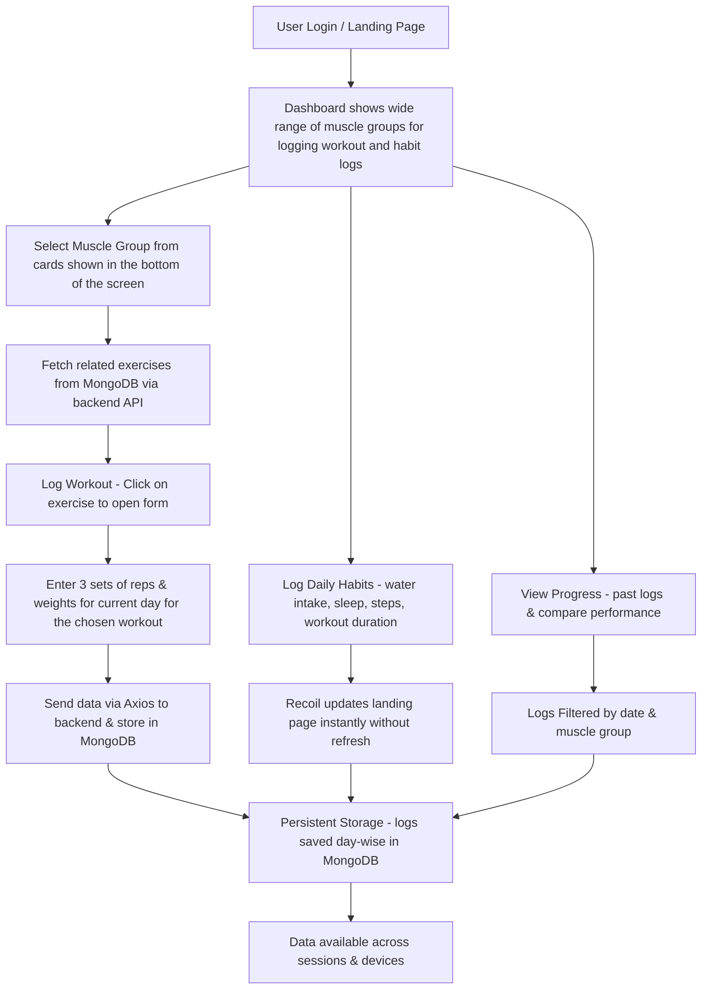

# 🏋️‍♂️ FitTrack  
*A web application to track your fitness goals and progress.*

🔗 **[Live Project](https://fittrack.itushar.site/)**  
🎥 **[Video Walkthrough](https://drive.google.com/file/d/11InJl2pY9CTRBHZsNuhqufWFR84Ie8Dl/view?usp=drive_link)**  

---

## 🌟 Overview  
**FitTrack** is a web-based fitness tracking application designed to help you **log workouts, set goals, and monitor your progress** over time.  
Whether you’re a **seasoned athlete** or just starting your fitness journey, FitTrack keeps you motivated with **visual progress tracking** and easy-to-use tools.  

---

## ✨ Features  

- 📊 **Dashboard** – Quick overview of daily activities including **water intake**, **workout duration**, and **step count**.  
- 🏋️ **Workout Logging** – Record exercises, sets, reps, and weights for each of your workout sessions in seconds.  
- 📈 **Progress Tracking** – Interactive charts and graphs to see your improvements over time.  
- 🔒 **User Authentication** – Secure registration and login to protect your personal data.  

---

## 💻 Tech Stack  

| Category       | Technologies Used |
|----------------|-------------------|
| **Frontend**   | React, Recoil, HTML, CSS, JavaScript |
| **Backend**    | Node.js, Express.js |
| **Database**   | MongoDB |
| **Deployment** | Netlify (Frontend), AWS EC2 (Backend) |

---

## 🔄 Project Flow  

1. **User Registration & Login** – Secure authentication to create and access personal fitness data.  
2. **Dashboard Display** – Shows daily stats like workout duration, step count, water intake, sleep duration.  
3. **Workout Logging** – User adds exercises with sets, reps, and weights.  
4. **Data Storage** – All logs are stored securely in MongoDB.  
5. **Progress Visualization** – Charts and graphs display trends over time.  

---

## 📌 Visual Workflow  




## 🚀 Getting Started  

Follow these steps to run **FitTrack** locally:  

### **Prerequisites**  
Make sure you have:  
- [Node.js](https://nodejs.org/) installed  
- npm (comes with Node.js)  

### **Installation**  

```bash
# Clone the repository
git clone https://github.com/your_username_/FitTrack.git

# Navigate into the project directory
cd FitTrack

# Install dependencies
npm install

# Start the development server
npm start
 ```


## 👨‍💻 Author  

**Tushar Paul**  
🔗 [GitHub](https://github.com/iTusharPaul) | 💼 [LinkedIn](https://www.linkedin.com/in/tushar-paul-cse/)  

